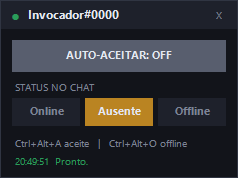

# Ghost

HUD flutuante para o League of Legends: aceita a partida automaticamente e troca seu status entre Online, Ausente e Offline sem sair do cliente.



> Projeto não oficial, sem vínculo com a Riot Games.

## O que faz

- Aceita o ready check sozinho, com atraso configurável
- Status do chat em um clique — incluindo *aparecer offline*, que o cliente não oferece
- Atalhos globais: `Ctrl+Alt+A` (auto-aceitar) e `Ctrl+Alt+O` (offline/online)
- Janela sem borda, arrastável, sempre por cima

Um script PowerShell. Sem instalação, sem dependência externa.

## Usar

```powershell
powershell -NoProfile -ExecutionPolicy Bypass -File .\ghost.ps1
```

| Parâmetro | Padrão | |
|---|---|---|
| `-IntervaloMs` | `700` | Frequência da checagem |
| `-AtrasoSegundos` | `0` | Espera antes de aceitar |
| `-AutoAceitarLigado` | off | Já abre ativo |

Ícone: `ghost-gerar-icone.ps1`. Versão só de console: `lol-auto-accept.ps1`.

## Como funciona

O cliente do LoL expõe uma API REST local — a **LCU API** — em `https://127.0.0.1:<porta>`. A interface do jogo é um app web que fala com ela, então todo botão da tela é uma chamada HTTP. O Ghost usa os mesmos endpoints:

| Endpoint | |
|---|---|
| `GET /lol-matchmaking/v1/ready-check` | tem partida? |
| `POST /lol-matchmaking/v1/ready-check/accept` | aceitar |
| `GET` / `PUT /lol-chat/v1/me` | ler e trocar o status |

Porta e senha saem do `lockfile` que o cliente grava na pasta de instalação (`LeagueClient:PID:PORTA:SENHA:https`), com senha nova a cada abertura. Nada de leitura de memória, clique simulado ou detecção de pixel.

## Decisões técnicas

**`curl.exe` no lugar de `Invoke-RestMethod`** — a LCU exige TLS 1.3, que o .NET Framework não fecha. O sintoma é um "conexão subjacente fechada" que não diz nada.

**Corpo JSON por arquivo (`-d @arquivo`)** — passar aspas por linha de comando atravessa dois analisadores e chega corrompido; a LCU responde 400.

**`RegisterHotKey` em vez de hook de teclado** — o hook veria tudo que você digita. O Ghost só é avisado da combinação registrada.

**`.ico` todo em BMP** — o `System.Drawing.Icon` do .NET Framework não lê entrada PNG dentro de `.ico`.

## Ícone

`ghost-gerar-icone.ps1` extrai o ícone do `LeagueClient.exe` instalado na sua máquina e aplica escala de cinza na metade esquerda.

O `.ico` gerado **não está no repositório** (veja o `.gitignore`): ele deriva de arte da Riot, e redistribuir asset é diferente de usar localmente. O repositório traz a receita, não o resultado. Sem o ícone o Ghost roda igual.

## Aviso

Automação de cliente é área cinzenta nos termos da Riot. O Ghost usa só a API local que o próprio cliente expõe — mesma abordagem de Blitz e Mobalytics — e não toca em memória nem em gameplay. Ainda assim é automação. Use por sua conta.

## Sobre

Escrito com assistência de IA (Claude). As decisões técnicas acima são as que orientaram o código, e estão comentadas dentro de cada script.

## Licença

MIT — veja [LICENSE](LICENSE).
