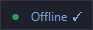

# Ghost

HUD flutuante para o League of Legends: aceita a partida automaticamente e troca seu status entre Online, Ausente e Offline sem sair do cliente.


> Projeto não oficial, sem vínculo com a Riot Games.

## O que faz

- Aceita o ready check sozinho, com atraso configurável
- Status do chat em um clique — incluindo *aparecer offline*, que o cliente não oferece
- **Offline fixado**: entrar em partida faz o cliente te tirar do offline sozinho. Enquanto o botão mostra `Offline ✓`, o Ghost devolve. Escolher Online ou Ausente solta
- **Auto-pick e auto-ban**, com fila montada numa grade dos 173 campeões
- **Aviso de autofill**: caiu numa lane que você não pediu, o auto-pick para em vez de travar um campeão que não joga ali
- **Runa automática**: travou o campeão, busca a runa mais jogada dele naquela lane no op.gg e grava na sua página `Ghost` — e coloca os dois feitiços de invocador que vão com ela, sem trocar a tecla do que você já usava
- **Tela de abertura**: você marca quais automações quer, e a HUD sobe só com elas
- Atalhos globais: `Ctrl+Alt+A` (auto-aceitar) e `Ctrl+Alt+O` (offline/online)
- A barra do topo diz em que ponto o cliente está: fora de fila, na fila, seleção de campeão, em partida
- **Sai do caminho no jogo**: a partida começou, a HUD vira uma barrinha só com o status do chat — e volta sozinha no fim
- Janela sem borda, arrastável, sempre por cima — e reabre onde você deixou

Um script PowerShell, sem instalação, uma instância por vez. A única coisa que vem de fora é a runa do op.gg, e ela tem plano B.

## Usar

```powershell
powershell -NoProfile -ExecutionPolicy Bypass -File .\ghost.ps1
```

| Parâmetro | Padrão | |
|---|---|---|
| `-IntervaloMs` | `700` | Frequência da checagem |
| `-AtrasoSegundos` | `0` | Espera antes de aceitar, com contagem na HUD |
| `-AutoAceitarLigado` | off | Já abre ativo |
| `-SegundosAteTravar` | `18` | Tempo com o campeão marcado antes de travar. `0` = instalock |
| `-Direto` | off | Pula a tela de abertura e usa o que ficou salvo |
| `-SemRunas` | off | Desliga a runa automática de vez |
| `-SemFeiticos` | off | Deixa seus feitiços de invocador em paz; só a runa entra |
| `-IgnorarAutofill` | off | Escolhe em qualquer lane, mesmo numa que você não pediu |
| `-Simular` | off | Escreve no log o que faria na seleção, sem tocar nela |

Ou clique num dos dois `.bat`, que repassam os mesmos parâmetros e funcionam chamados de qualquer pasta:

- **`ghost.bat`** — o normal. Sobe a HUD e some; o console nem pisca.
- **`ghost-console.bat`** — o mesmo com o console à vista e uma pausa no fim, para quando o Ghost não abre e você quer ler o erro.

Preferências ficam em `%APPDATA%\Ghost\ghost.json` — apagar o arquivo volta tudo ao padrão. Os ícones dos campeões ficam em `%APPDATA%\Ghost\icones\` (~6 MB, baixados uma vez do próprio cliente).

Ícone: `ghost-gerar-icone.ps1`. Versão só de console: `lol-auto-accept.ps1`.

## Escolher o que aparece

O Ghost faz cinco coisas e ninguém usa as cinco. Então ele pergunta antes de subir: você marca o que quer, aperta OK, e a HUD aparece só com aquilo. **A altura da janela é resultado do que ficou ligado**, não um número fixo: cada grupo é uma linha de botões, e o que você desmarca não ocupa espaço.

A escolha fica salva. **Clique direito na barra do topo** reabre a tela; `-Direto` pula a pergunta e usa o que estava salvo. Desmarcar ali **desliga a automação junto**, não só esconde o botão. O `_` ao lado do `X` minimiza para a barra de tarefas.

Não tem texto fixo além do nome dos botões. **Passe o mouse** num deles para ver o que faz e qual o atalho; na barra do topo aparecem o seu nick e de quanto em quanto tempo o Ghost está checando a partida.

## Durante a partida



Quando o jogo abre, a HUD **recolhe para a barra do topo**, com o status do chat e mais nada — dentro da partida é a única coisa que ainda muda, pelo `Ctrl+Alt+O`. A partida acabou, ela volta sozinha.

A barra recolhida tem **posição própria**: arraste uma vez para um canto que não atrapalhe o jogo e ela aparece lá nas próximas partidas, sem levar a HUD aberta junto. Até você arrastar, ela nasce onde a HUD estava, encostada do mesmo lado da tela.

**Clique duplo na barra** recolhe e abre na mão, a qualquer hora. Recolheu fora da partida, fica recolhida até você abrir: o fim da partida só desfaz o que a partida fez.

## Escolher e banir

O **+**, na ponta da linha do Pick e do Ban, abre uma grade com os 173 campeões, usando os ícones que o cliente já tem em disco. Clique escolhe, clique direito bane, clique na fila tira de lá. A ordem da fila é a ordem de preferência.

Na sua vez, o Ghost pega o primeiro da fila que ainda estiver livre — pulando quem já foi banido, escolhido, ou está marcado por um aliado. O ban sai direto. O pick **marca o campeão e trava depois**: marcar avisa o time o que você vai pegar, e até travar dá tempo de mudar de ideia na mão. `-SegundosAteTravar 0` volta ao instalock.

Os botões `Pick` e `Ban` ficam **âmbar** quando estão ligados com a fila vazia — verde ali prometeria uma automação que não vai acontecer.

### Quando o autofill te pega

A fila de pick é uma só e não sabe de lane. Montada pensando em mid, ela vira um problema no segundo em que o cliente te joga de suporte: sem checagem, o Ghost travaria o primeiro da fila do mesmo jeito.

Então ele compara a lane atribuída com as que você pediu no lobby. Não bateu, o auto-pick **para**, o botão fica âmbar e o log diz qual lane veio. O ban não passa por essa checagem — banir não depende da sua lane.

**Ele só bloqueia quando tem certeza.** Sem lane atribuída (cega, ARAM), com fill pedido, ou sem conseguir ler sua preferência no lobby, ele libera.

> Rode com `-Simular` na primeira partida. Ele escreve no log o que faria, sem tocar na seleção. O aviso de autofill ainda não foi visto numa seleção de verdade.

## Runa automática

Travou o campeão — no automático ou escolhendo na mão —, o Ghost pega a lane que você recebeu, busca no op.gg a runa mais jogada daquele campeão nela, grava na sua página e seleciona. A página fica com o nome `Ghost Runa <Campeão>`.

**Antes de usar, renomeie uma das suas páginas de runa para `Ghost`.** Ele só escreve numa página cujo nome comece com isso, e edita no lugar em vez de apagar e recriar. Não achou, não faz nada e avisa no log. É essa regra que impede um bug aqui de comer uma página que você montou à mão.

Sem lane atribuída — treino, escolha às cegas, ARAM — ele pede ao op.gg a **lane mais jogada** daquele campeão, e o log diz isso.

O op.gg **não é API pública, é raspagem** — o dia que mudarem a estrutura da página, quebra. Por isso existe a queda: fora do ar ou campeão sem página lá, e ele usa a **recomendação da própria Riot**, servida pelo cliente. Não é a build de maior winrate, mas funciona offline. O log sempre diz qual das duas foi usada.

Os 173 campeões funcionam, inclusive os quatro cujo apelido interno não bate com o nome (`MonkeyKing`, `Nunu`, `Renata`, `Bard`) — testados um a um.

### Feitiços de invocador

Da mesma página saem os **dois feitiços mais jogados** naquela lane, e o Ghost coloca os dois na sua seleção — é o que o botão de importar do op.gg faz. A tecla do Flash você escolhe na tela de abertura: **D**, **F**, ou *onde estava*. Nesse último, quem já estava numa tecla fica nela — Flash no F continua no F, o outro entra no D — e só quando nenhum dos dois estava na seleção ele usa a ordem do site.

Feitiço não tem plano B: se a runa veio da Riot porque o op.gg falhou, os seus ficam como estavam, e o log avisa. `-SemFeiticos` desliga só essa parte.

> Os feitiços ainda não foram vistos numa seleção de verdade — a leitura do op.gg e a regra da tecla têm teste, a chamada ao cliente não. Rode a primeira com `-Simular`, que escreve no log a dupla que mandaria sem mandar.

## Como funciona

O cliente do LoL expõe uma API REST local — a **LCU API** — em `https://127.0.0.1:<porta>`. A interface do jogo é um app web que fala com ela, então todo botão da tela é uma chamada HTTP. O Ghost usa os mesmos endpoints:

| Endpoint | |
|---|---|
| `GET /lol-matchmaking/v1/ready-check` | tem partida? |
| `POST /lol-matchmaking/v1/ready-check/accept` | aceitar |
| `GET` / `PUT /lol-chat/v1/me` | ler e trocar o status |
| `GET /lol-gameflow/v1/gameflow-phase` | em que ponto o cliente está |
| `GET /lol-lobby/v2/lobby` | as lanes que você pediu |
| `GET /lol-perks/v1/pages` | suas páginas de runa |
| `PUT /lol-perks/v1/pages/<id>` | grava a runa na página |
| `PUT /lol-perks/v1/currentpage` | seleciona a página |
| `GET /lol-perks/v1/recommended-pages/...` | a runa que a Riot sugere |
| `GET /lol-champ-select/v1/session` | de quem é a vez, e do quê |
| `PATCH /lol-champ-select/v1/session/actions/<id>` | escolher ou banir |
| `PATCH /lol-champ-select/v1/session/my-selection` | trocar os feitiços de invocador |
| `GET /lol-game-data/assets/v1/champion-summary.json` | lista de campeões |
| `GET /lol-game-data/assets/v1/champion-icons/<id>.png` | os ícones |

Porta e senha saem do `lockfile` que o cliente grava na pasta de instalação (`LeagueClient:PID:PORTA:SENHA:https`), com senha nova a cada abertura. Nada de leitura de memória, clique simulado ou detecção de pixel.

## Testes

```powershell
powershell -NoProfile -ExecutionPolicy Bypass -File .\testes\rodar.ps1
```

Cinco arquivos: gate de autofill, layout da HUD (inclusive recolher no jogo), runas, feitiços e nome de campeão. Eles **recortam as funções de dentro do `ghost.ps1`** em vez de duplicar código — o script é um arquivo só, com janela e loop no nível de cima, então dot-source abriria a HUD.

Nenhum abre janela nem escreve na sua conta. Os de runas e feitiços buscam de verdade no op.gg e precisam de internet; o de nome de campeão precisa do cliente aberto, e se pula sozinho se estiver fechado.

## Decisões técnicas

**`curl.exe` no lugar de `Invoke-RestMethod`** — a LCU exige TLS 1.3, que o .NET Framework não fecha. O sintoma é um "conexão subjacente fechada" que não diz nada.

**Os interruptores são `-SemRunas` e `-SemFeiticos`, não `-Runas:$false`** — parâmetro `[bool]` não passa por `powershell -File`: tudo chega como texto, e `$false` vira a string `$false`, que o PowerShell recusa converter. É assim que os dois `.bat` e o comando lá em cima chamam o script, então a versão anterior, `-Runas:$false`, só funcionava de dentro de um prompt do PowerShell. `[switch]` passa por qualquer caminho.

**Corpo JSON por arquivo (`-d @arquivo`)** — passar aspas por linha de comando atravessa dois analisadores e chega corrompido; a LCU responde 400.

**`RegisterHotKey` em vez de hook de teclado** — o hook veria tudo que você digita. O Ghost só é avisado da combinação registrada.

**`.ico` todo em BMP** — o `System.Drawing.Icon` do .NET Framework não lê entrada PNG dentro de `.ico`.

**A fase do cliente define o ritmo da checagem** — em seleção de campeão, em partida ou na tela de fim não existe ready check para pegar, e essas são justo as fases longas. Nelas a checagem cai de `-IntervaloMs` para um tick a cada ~3s — a dica da barra do topo mostra o intervalo exato, que com os 700ms padrão dá 2,8s, porque a conta arredonda em ticks inteiros. Fase desconhecida mantém o ritmo rápido: checar demais custa CPU, checar de menos perde a partida.

**Texto fixo na HUD, só quando tem problema** — títulos de seção, o lembrete dos atalhos, a linha da fase e o ON/OFF do auto-aceitar saíram. Com um botão por grupo o nome já explica, e ligado ou desligado é a cor, como em todos os outros botões. O que ainda precisava de texto foi para a dica do mouse. A única linha fixa que sobrou é o aviso de atalho tomado por outro app, e ela só aparece quando isso acontece: atalho que não funciona tem que estar na cara, não escondido numa dica.

**Barra normal no caminho de saída do `curl -K`** — dentro de aspas num arquivo de configuração o `curl` trata `\` como início de escape: com `C:\Users\...` ele baixa, conta os bytes e grava **zero** arquivos, calado. Com `C:/Users/...` funciona. Essa pegou duas vezes — nos 173 ícones, que vêm numa chamada só porque na linha de comando a lista passaria de 22 mil caracteres, e depois na busca do op.gg.

**A busca da runa sai num processo separado** — as chamadas HTTP acontecem na thread da interface. Para resposta local de 2 KB não custa nada; a página do op.gg tem ~640 KB e vem de fora, e baixar ali congelaria a HUD no meio da seleção. O `curl` roda solto e o resultado é colhido num tick seguinte, em ~0,6s.

**Quem valida id de runa é o Ghost, porque o cliente não valida** — mandando `1,2,3` ele grava `1,2,3,-1,-1,-1` sem reclamar. Toda runa passa por checagem de faixa antes de chegar perto da sua página, duas vezes: na leitura de cada fonte e de novo na hora de gravar.

**Nada de `$c` como variável de laço** — nome de variável no PowerShell não diferencia maiúscula de minúscula, e o escopo é dinâmico: uma função lê o local de quem a chamou. Um `foreach ($c in ...)` apaga a tabela de cores `$C` para tudo que for chamado dali para baixo, e `$C.Verde` vira `$null` sem aviso.

**Nada de closure em evento do WinForms** — o scriptblock de um evento dispara da fila de mensagens, muito depois de a função que o criou ter saído de cena. Tudo que os handlers precisam mora em escopo de script, e eles falam por nome de função.

**Toda ação de botão passa por um `try`** — exceção dentro de um handler do WinForms não aparece em lugar nenhum: o console está escondido e o WinForms engole. O sintoma é a HUD parada numa linha de log antiga. Agora o erro fica na linha de log e em `%APPDATA%\Ghost\erro.txt`.

**O `-AtrasoSegundos` conta pelo relógio, não com `Start-Sleep`** — tudo roda na thread da interface, então dormir ali congelaria a HUD e os atalhos globais justo nos segundos que importam. Do jeito atual a contagem aparece na tela e dá para cancelar no meio dela.

## Ícone

`ghost-gerar-icone.ps1` extrai o ícone do `LeagueClient.exe` instalado na sua máquina e aplica escala de cinza na metade esquerda.

O `.ico` gerado **não está no repositório** (veja o `.gitignore`): ele deriva de arte da Riot, e redistribuir asset é diferente de usar localmente. O repositório traz a receita, não o resultado. Sem o ícone o Ghost roda igual.

## Aviso

Automação de cliente é área cinzenta nos termos da Riot. O Ghost usa só a API local que o próprio cliente expõe — mesma abordagem de Blitz e Mobalytics — e não toca em memória nem em gameplay. Ainda assim é automação. Use por sua conta.

**Auto-pick e auto-ban pesam mais que o auto-aceitar**, e vale saber por quê. Aceitar a partida sozinho só afeta você. Escolher e banir sozinho age dentro da seleção, que é compartilhada com mais nove pessoas: um ban automático pode derrubar o campeão que um aliado ia pegar, e um pick automático decide a composição do time sem olhar para ela. É por isso que o padrão marca o campeão e só trava depois de `-SegundosAteTravar`. Instalock é uma opção, não o padrão.

## Sobre

Fiz o Ghost pra usar no meu dia a dia de LoL. A ideia, o que cada parte faz e os testes dentro do jogo são meus; usei IA (Claude) pra ajudar a escrever o código.

## Licença

MIT — veja [LICENSE](LICENSE).
